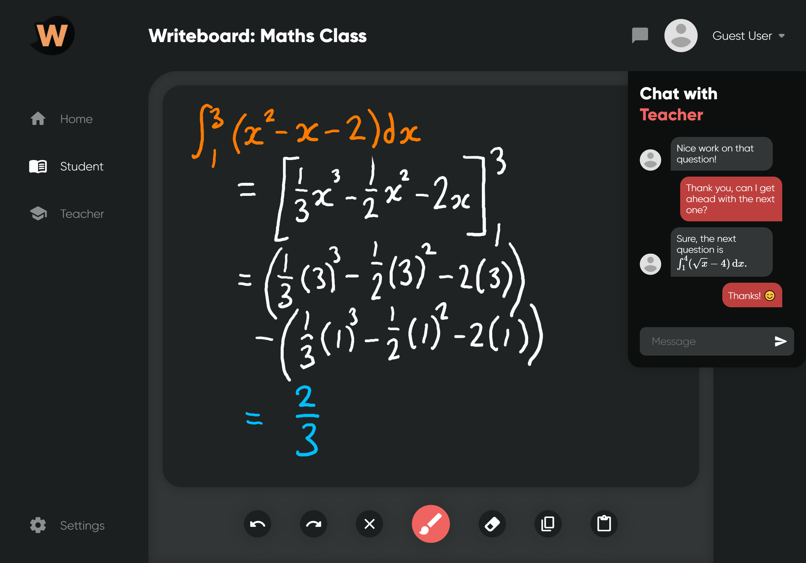
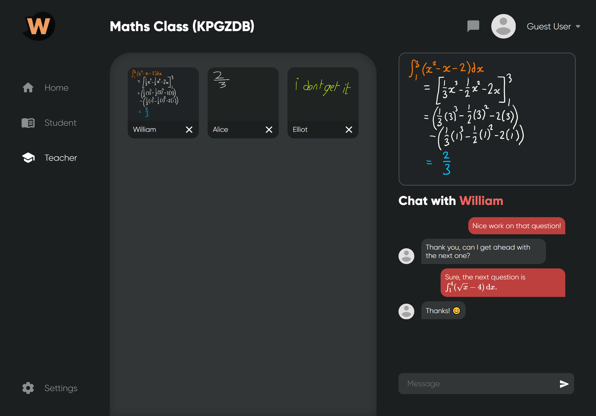

     
    
    
    

# Writeboard
Writeboard is a simple yet stylish whiteboard app which allows any class or team to share their ideas quickly and easily. Built using the latest web technologies, Writeboard offers a user-friendly and intuitive platform for students to engage with lessons and make progress in today's online world.

## Features
Here at Writeboard, we believe that everyone should have a top-quality interactive learning experience, which is why we built Writeboard from the ground up using state-of-the-art web technologies to optimise the user's experience. Here are just a few features of Writeboard which we believe makes it a true contender in the world of online learning software.

- Intuitive whiteboard interface with numerous tools
- Support for pen pressure and pens with erasers
- Instant two-way messaging between the teacher and the student
- Near real-time streaming of the boards to the teacher
- Secure rooms: you can lock your room and kick disruptive users
- Committed to privacy
- Unlimited users so even the biggest classes can enjoy it
- **Completely free for everyone**

## Screenshots
These screenshots were both taken emulating an iPad Pro, but thanks to Writeboard's responsive design, you can be sure that it'll look just as great on larger and smaller screens.

| Student | Teacher |
| --- | --- |
|  |  |

## Technologies Used

### Whiteboard

- [PointerEvents](https://developer.mozilla.org/en-US/docs/Web/API/Pointer_events) for the cross-platform input
- [HTML5 canvas](https://developer.mozilla.org/en-US/docs/Web/API/Canvas_API) for the rendering and exporting of the whiteboard

### User Interface

- [SweetAlert2](https://sweetalert2.github.io) for all of the snazzy popups
- [Material Design Icons](https://material.io/resources/icons) for all of the icons except the eraser which is just an SVG

### Networking

- [Firebase Realtime Database](https://firebase.google.com/docs/database) for pretty much everything
- [Netlify](https://www.netlify.com) for hosting
- [Freenom](https://www.freenom.com/) for the domain name