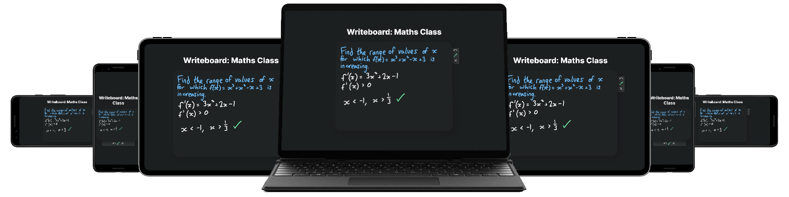

# Writeboard
Writeboard is a simple yet stylish whiteboard web app which allows any team to share their ideas easily and instantly. Brought to you by the developers of the critically-acclaimed education apps [Sadlet](https://github.com/w-henderson/Sadlet) and [Kascreech](https://github.com/w-henderson/Kascreech), Writeboard offers a user-friendly and intuitive platform for collaboration and communication, powered by Google's Firebase backend system.

## Features
Here at Writeboard, we believe that everyone should have a top-quality collaborative experience, which is why we built Writeboard from the ground up using state-of-the-art web technologies to optimise the user's experience. Here are just a few features of Writeboard which we believe makes it a true contender in the world of team software.

- Intuitive whiteboard interface with numerous tools
- Support for pen pressure and pens with erasers
- Instant two-way messaging between the host and the client
- Less than five seconds image latency, reduced to one when the board is maximised
- Secure rooms: ability to lock rooms and kick disruptive users
- Committed to privacy: all your board data is deleted as soon as the room is closed
- Completely free for everyone

## Technologies Used

### Whiteboard

- [PointerEvents](https://developer.mozilla.org/en-US/docs/Web/API/Pointer_events) for the cross-platform input
- [curve()](https://stackoverflow.com/a/17286720/6106196) to smooth out the strokes (was previously using [Smooth.js](https://github.com/osuushi/Smooth.js))
- [HTML5 canvas](https://developer.mozilla.org/en-US/docs/Web/API/Canvas_API) for the rendering and exporting of the whiteboard

### User Interface

- [SweetAlert2](https://sweetalert2.github.io) for all of the snazzy popups
- [Material Design Icons](https://material.io/resources/icons) for all of the icons except the eraser which is just an SVG

### Networking

- [Firebase Realtime Database](https://firebase.google.com/docs/database) for pretty much everything
- [Netlify](https://www.netlify.com) for hosting
- [Freenom](https://www.freenom.com/) for the domain name